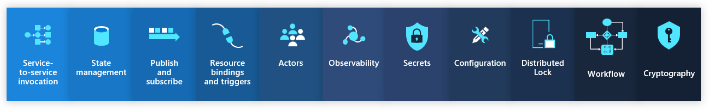

# Quick overview

Building modern, cloud-native applications can resemble a complex puzzle filled with multiple pieces.

This includes managing connections to external services, handling sensitive data like secrets and connection strings, and appropriately
configuring your application for interactions with fellow applications.

The complexity doesn't just limit itself to the development phase but extends into operations, particularly in managing how components
function and interact at a local level and when deployed.

You want to minimize the local-to-production operations discrepancy as much as possible.

## Building blocks and components

Dapr is built around the concept of building blocks and components.

### Building blocks

Building blocks are a set of abstracted, pluggable APIs that take care of common distributed system concerns for you, including state
management, pub/sub messaging, service invocation (method calling), binding to external systems, and distributed tracing. With Dapr's
building blocks, developers don't need to write complex infrastructural code themselves but can leverage pre-existing solutions via the
standardized APIs.

> You interact with building blocks through HTTP or GRPC.

### Components

Components, on the other hand, can be thought of as the implementation details behind these building blocks. They are modular pieces of code
that interact with different technologies or infrastructures, such as databases, messaging systems, or else. You can swap out one component
for another without changing your application's code at all. Components allow developers to flexibly pair Dapr's abstracted APIs with
specific technologies to best fit their requirements.

In short, Building Blocks provide the API abstractions and components provide the specific implementations for these APIs based on your
chosen technologies or services. They work together to simplify the development of distributed systems by hiding the complexity behind
intuitive interfaces.

## The dapr sidecar

Every "daprized" application has a "dapr sidecar". This dapr sidecar handles the interactions with building blocks and components are loaded
into the sidecar by using component yaml definitions.

Let's look at the sidecar next.

<seealso>
    <category ref="external">
        <a href="https://docs.dapr.io/concepts/building-blocks-concept/">Building blocks</a>
        <a href="https://docs.dapr.io/concepts/components-concept/">Components</a>
    </category>
</seealso>