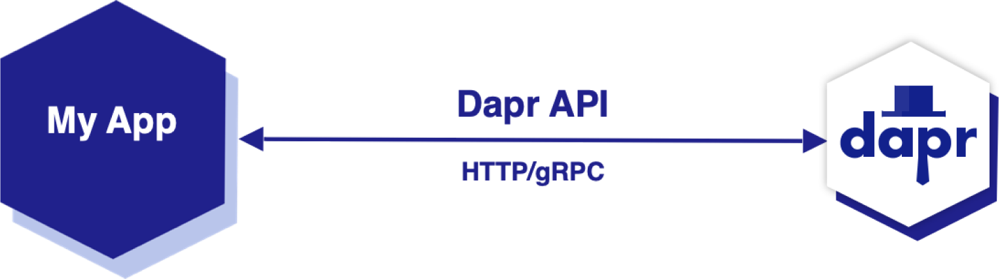

# Dapr sidecar

Think of the dapr sidecar as your application's best friend.

The Dapr sidecar is an essential component of Dapr's runtime environment. When you run a Dapr-enabled application, a Dapr sidecar is
automatically injected and runs alongside your application. This is where the term "sidecar" comes from: it's a separate process attached to
your main application, similar to a sidecar attached to a motorcycle.

The sidecar process contains all of Dapr's capabilities, such as state management, service invocation, pub/sub, and so on. Your application
communicates with the sidecar via HTTP or gRPC, and the sidecar communicates with the rest of your system on behalf of your application.

> Dapr sidecars are created with an app-id that enables service discovery.

Here's why the sidecar model is important:

1. Decoupling from Infrastructure: The sidecar model helps decouple your application logic from the infrastructure concerns. All the
   interactions with other services or systems are handled by the Dapr sidecar. Your application only needs to interact with the Dapr API,
   not with the underlying infrastructure.
2. Polyglot Capability: The Dapr sidecar provides a consistent, language-agnostic API over HTTP or gRPC. This means you can write your
   application in any programming language, and it can take advantage of Dapr's features via the sidecar.
3. Simplicity and Maintainability: The sidecar model simplifies your application code. Since the sidecar handles complex tasks like state
   management and service invocation, your application code can be simpler and more focused on business logic.
4. Scalability and Reliability: Each instance of your application gets its own Dapr sidecar. This means that as your application scales, the
   Dapr capabilities scale with it. The sidecar model also improves reliability, as each application instance is isolated from others.

Dapr's sidecar architecture enables your applications to leverage all of Dapr's features in a decoupled, language-agnostic,
and scalable manner. Your application interacts with the Dapr sidecar, and the sidecar handles all the interactions with other systems and
services.

Next, let's look at another core concept: **building blocks**.